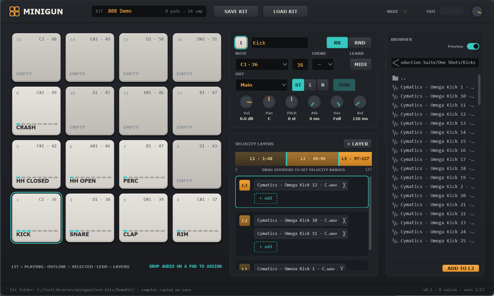

# Minigun

Lightweight VST3 / Standalone drum sampler built with JUCE 8. Sixteen MPC-style pads, velocity layers with round-robin or random samples, choke groups, per-pad routing to 17 stereo outputs, and portable kits that carry their own samples.

**English** · [Українська](#minigun-українською)



## Features

- **16 pads** in MPC order (pad 1 bottom-left). Click to play with velocity from the click height; drop audio files from Explorer or the built-in browser to assign them.
- **Velocity layers**: up to 8 per pad, draggable range dividers, click a segment to audition that layer. Any number of samples per layer, alternated **round-robin** or **random**.
- **Drag & drop inside the plug-in**: drag a pad onto another pad to move it (with confirmation), drag a sample chip to reorder it or move it to another layer (Ctrl on drop copies).
- **Per-pad settings**: MIDI note (drop-down + number field, MIDI learn), choke group, volume, pan, pitch ±12 st, attack / decay / release.
- **Velocity → volume switch** (**VEL**, per pad): on = velocity scales the level (default), off = every hit plays at full level while the velocity still picks the layer. Ctrl+click the button to set all 16 pads at once.
- **Humanize** (advanced strip under the pads): **RND PITCH** (±0–50 cents) and **RND VOL** (±0–6 dB) draw a fresh random offset on every hit, so a repeated sample stops combing into a machine-gun. **TRIG** applies 10 c / 1.0 dB to all 16 pads for kits played from a programmed or drum-replaced MIDI track. Timing is never randomised.
- **Sample-accurate MIDI**: a note starts on the exact sample it arrives on, not on the audio-buffer boundary — no timing jitter against other instruments.
- **Knob handling**: every knob has a typable value field under it (`L40`, `Full`, `OFF` are understood) and Ctrl+click (or double-click) resets it to its default.
- **Outputs**: Main + 16 aux stereo buses (34 channels). Each pad picks its bus and can go **stereo** or **mono** to a single channel, with optional stereo-to-mono summing.
- **Pads glow in the colour of the layer that played**, from MIDI and from mouse clicks alike.
- **Undo / Redo** for every kit edit (header buttons, Ctrl+Z / Ctrl+Y), with knob sweeps and typing merged into single steps.
- **Built-in browser** with instant preview, drag & drop to pads or layers, editable path, drive list, Backspace / Alt+arrows / mouse Back-Forward navigation.
- **Portable kits**: *Save kit* copies every sample into `<kit>/samples/` and writes `kit.json` with relative paths, so a kit folder can be moved between projects and machines. The full kit is also stored in the DAW project.
- Formats: WAV, AIFF, FLAC, OGG, MP3, WMA.

## Installation

- **VST3**: copy the `Minigun.vst3` folder to `C:\Program Files\Common Files\VST3\` and rescan plug-ins in your DAW. The plug-in appears as *VST3i: Minigun (Dallas Audio)*.
- **Standalone**: run `Minigun.exe` and pick an audio device and MIDI input under *Options*.

## Building (Windows)

Requirements: Visual Studio 2022 Build Tools (C++ workload), CMake ≥ 3.22, JUCE 8.0.4 in `external/JUCE` (not included in the repository):

```bash
git clone --depth 1 --branch 8.0.4 https://github.com/juce-framework/JUCE external/JUCE
```

```bash
cmake -S . -B build -G "Visual Studio 17 2022" -A x64
```

```bash
cmake --build build --config Release --target Minigun_VST3 Minigun_Standalone
```

Outputs: `build\Minigun_artefacts\Release\VST3\Minigun.vst3` and `build\Minigun_artefacts\Release\Standalone\Minigun.exe`. Copying to the system VST3 folder needs an elevated shell.

## Routing pads to separate DAW tracks

The plug-in exposes 17 stereo outputs. In the pad editor choose **OUT** (Main, Out 1-2 … Out 31-32) and **ST / L / R** (stereo pair, or mono to the odd / even channel; **SUM** folds a stereo sample to mono).

REAPER example: increase the track channel count (e.g. 8 for Main + three aux pairs), set pads to *Out 1-2*, *Out 3-4*, *Out 5-6*, then add receives from channels 3/4, 5/6, 7/8 on separate tracks, or use *Build multichannel routing for this plug-in*. The plug-in footer shows how many buses the host has enabled (`outs N/17`). A pad routed to a bus the host has not enabled falls back to Main.

## Kit format

```
My Kit\
  kit.json
  samples\
    kick_01.wav
    ...
```

`kit.json` (excerpt):

```json
{ "format": "minigun-kit", "version": 1, "name": "808 Basic",
  "pads": [ { "index": 0, "name": "Kick", "note": 36, "mode": "rr", "choke": 0,
              "volumeDb": 0.0, "pan": 0.0, "pitch": 0.0,
              "attackMs": 0.0, "decayMs": -1, "releaseMs": 120,
              "output": 0, "outMode": "stereo", "monoSum": true, "velToVol": true,
              "layers": [ { "lo": 1, "hi": 127, "samples": ["samples/kick_01.wav"] } ] } ] }
```

Default kits folder: `Documents\Minigun Kits`.

## Documentation

- [User manual (English, PDF)](docs/Minigun_User_Manual_EN.pdf)
- [Інструкція користувача (українська, PDF)](docs/Minigun_Instrukciya_UA.pdf)
- Sources: `docs/manual_en.html`, `docs/manual_uk.html`, `docs/manual.css`, screenshots in `docs/img/`. Rebuild the PDFs with `docs/build-pdf.ps1` (headless Edge).
- [ARCHITECTURE.md](ARCHITECTURE.md) — technical specification.

## Project structure

- `src/Model` — data model (`KitModel.h`) and kit save/load (`KitStore`)
- `src/Engine` — sample loading, voices, real-time sampler engine
- `src/UI` — interface components following the design in `design/`
- `design/` — design canvas (`Main.dc.html`, `PadStates.dc.html`)
- `docs/` — manuals

## License

Minigun is free software: you can redistribute it and/or modify it under the terms of the **GNU Affero General Public License v3.0** (see [LICENSE](LICENSE)). Copyright © 2026 Andrii Dalevskyi (Dallas Audio).

Third-party components:
- [JUCE](https://juce.com) © Raw Material Software Limited — used under the AGPLv3.
- VST3 SDK © Steinberg Media Technologies GmbH — used under the GPLv3. *VST* is a trademark of Steinberg Media Technologies GmbH.

Binaries in the Releases section are built from this source; the corresponding source is this repository at the tagged commit.

---

# Minigun (українською)

Легкий драм-семплер VST3 / Standalone на JUCE 8. Шістнадцять педів у стилі MPC, велосіті-леєри з round-robin або випадковими семплами, choke-групи, маршрутизація кожного педа на 17 стерео-виходів і портативні кіти, що носять свої семпли з собою.

## Можливості

- **16 педів** у порядку MPC (пед 1 знизу зліва). Клік грає з velocity за висотою кліку; аудіофайли з Провідника або вбудованого браузера призначаються перетягуванням.
- **Велосіті-леєри**: до 8 на пед, розділювачі діапазонів тягнуться мишею, клік по сегменту прослуховує леєр. У леєрі будь-яка кількість семплів, що чергуються **round-robin** або **випадково**.
- **Drag & drop усередині плагіна**: пед перетягується на інший пед (з підтвердженням), семпл-чіп — на іншу позицію в леєрі або в інший леєр (Ctrl при відпусканні копіює).
- **Налаштування педа**: MIDI-нота (дропдаун + числове поле, MIDI learn), choke-група, гучність, панорама, висота ±12 півтонів, attack / decay / release.
- **Перемикач velocity → гучність** (**VEL**, окремо на кожен пед): увімкнено — velocity масштабує рівень (типово), вимкнено — кожен удар грає на повній гучності, а velocity все одно обирає леєр. Ctrl+клік по кнопці — одразу на всі 16 педів.
- **Гуманайзер** (смуга Advanced під педами): **RND PITCH** (±0–50 центів) і **RND VOL** (±0–6 dB) дають новий випадковий зсув на кожен удар, тож повторюваний семпл перестає збиватися в «кулемет». **TRIG** застосовує 10 c / 1,0 dB до всіх 16 педів — для кітів, що грають із запрограмованого або drum-replaced MIDI-треку. Тайминг не рандомізується.
- **Семпл-точний MIDI**: нота стартує рівно на тому семплі, на якому прийшла, а не на межі аудіо-буфера — жодного джитеру відносно інших інструментів.
- **Робота з крутилками**: під кожною є поле для введення значення (розуміє `L40`, `Full`, `OFF`), а Ctrl+клік (або подвійний клік) повертає дефолт.
- **Виходи**: Main + 16 додаткових стерео-шин (34 канали). Кожен пед обирає шину і може йти **стерео** або **моно** на один канал, з опційним сумуванням стерео-семпла в моно.
- **Педи світяться кольором леєра, який зіграв**, і від MIDI, і від кліку мишею.
- **Undo / Redo** для всіх змін кіта (кнопки в шапці, Ctrl+Z / Ctrl+Y); обертання регулятора чи набір назви — один крок.
- **Вбудований браузер** із миттєвим прослуховуванням, перетягуванням на педи чи леєри, редагованим шляхом, списком дисків, навігацією Backspace / Alt+стрілки / бічні кнопки миші.
- **Портативні кіти**: *Save kit* копіює всі семпли в `<кіт>/samples/` і пише `kit.json` з відносними шляхами, тож теку кіта можна переносити між проєктами й комп'ютерами. Повний кіт також зберігається в проєкті DAW.
- Формати: WAV, AIFF, FLAC, OGG, MP3, WMA.

## Установка

- **VST3**: скопіюйте теку `Minigun.vst3` у `C:\Program Files\Common Files\VST3\` і пересканируйте плагіни в DAW. Плагін з'явиться як *VST3i: Minigun (Dallas Audio)*.
- **Standalone**: запустіть `Minigun.exe` і в *Options* оберіть аудіопристрій та MIDI-вхід.

## Збірка (Windows)

Потрібні: Visual Studio 2022 Build Tools (C++), CMake ≥ 3.22, JUCE 8.0.4 у `external/JUCE` (у репозиторій не входить):

```bash
git clone --depth 1 --branch 8.0.4 https://github.com/juce-framework/JUCE external/JUCE
```

```bash
cmake -S . -B build -G "Visual Studio 17 2022" -A x64
```

```bash
cmake --build build --config Release --target Minigun_VST3 Minigun_Standalone
```

Результат: `build\Minigun_artefacts\Release\VST3\Minigun.vst3` і `build\Minigun_artefacts\Release\Standalone\Minigun.exe`. Копіювання в системну теку VST3 потребує прав адміністратора.

## Маршрутизація педів на окремі треки DAW

Плагін має 17 стерео-виходів. У редакторі педа оберіть **OUT** (Main, Out 1-2 … Out 31-32) і **ST / L / R** (стерео-пара або моно на непарний / парний канал; **SUM** згортає стерео-семпл у моно).

Приклад для REAPER: збільшіть кількість каналів треку (напр. 8 для Main + три пари), поставте педи на *Out 1-2*, *Out 3-4*, *Out 5-6*, потім додайте receive з каналів 3/4, 5/6, 7/8 на окремі треки або скористайтесь *Build multichannel routing for this plug-in*. Футер плагіна показує, скільки шин увімкнув хост (`outs N/17`). Пед, направлений на невключену шину, автоматично грає в Main.

## Формат кіта

```
Мій кіт\
  kit.json
  samples\
    kick_01.wav
    ...
```

`kit.json` (фрагмент):

```json
{ "format": "minigun-kit", "version": 1, "name": "808 Basic",
  "pads": [ { "index": 0, "name": "Kick", "note": 36, "mode": "rr", "choke": 0,
              "volumeDb": 0.0, "pan": 0.0, "pitch": 0.0,
              "attackMs": 0.0, "decayMs": -1, "releaseMs": 120,
              "output": 0, "outMode": "stereo", "monoSum": true, "velToVol": true,
              "layers": [ { "lo": 1, "hi": 127, "samples": ["samples/kick_01.wav"] } ] } ] }
```

Стандартна тека кітів: `Документи\Minigun Kits`.

## Документація

- [Інструкція користувача (українська, PDF)](docs/Minigun_Instrukciya_UA.pdf)
- [User manual (English, PDF)](docs/Minigun_User_Manual_EN.pdf)
- Джерела: `docs/manual_uk.html`, `docs/manual_en.html`, `docs/manual.css`, скріншоти в `docs/img/`. Перегенерувати PDF: `docs/build-pdf.ps1` (Edge у headless-режимі).
- [ARCHITECTURE.md](ARCHITECTURE.md) — технічна специфікація.

## Структура проєкту

- `src/Model` — модель даних (`KitModel.h`) і збереження/завантаження кіта (`KitStore`)
- `src/Engine` — завантаження семплів, голоси, real-time рушій семплера
- `src/UI` — компоненти інтерфейсу за дизайном у `design/`
- `design/` — дизайн-полотно (`Main.dc.html`, `PadStates.dc.html`)
- `docs/` — інструкції

## Ліцензія

Minigun — вільне програмне забезпечення: його можна поширювати і змінювати на умовах **GNU Affero General Public License v3.0** (див. [LICENSE](LICENSE)). © 2026 Андрій Далевський (Dallas Audio).

Сторонні компоненти:
- [JUCE](https://juce.com) © Raw Material Software Limited — використовується за AGPLv3.
- VST3 SDK © Steinberg Media Technologies GmbH — за GPLv3. *VST* — торгова марка Steinberg Media Technologies GmbH.

Бінарники у розділі Releases зібрані з цього репозиторію; відповідний вихідний код — коміт із тим самим тегом.
